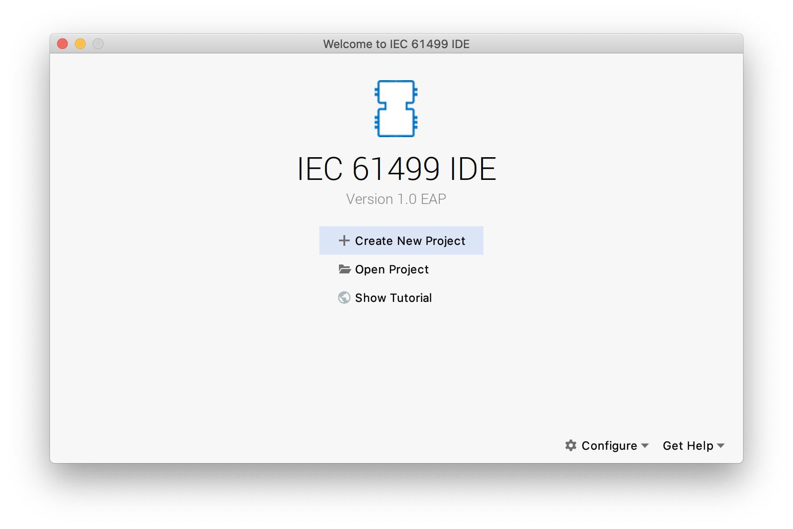

The tutorial highlights the basic features of the FBME platform.
During the tutorial, we will build a small application and deploy it on a local device of the supported 4diac FORTE
runtime environment.

### Create a new project

To start the tutorial, open the FBME platform.
The figure below shows the view of the platform on the first start.

Let's press `Create New Project`.
You will be prompted to enter the project name.
Let's name the project as _Blinking Sample_, choose _System Configuration_ project template and name our system as 
_BlinkingSystem_.

The platform will create a system for us with one contained application called _BlinkingSystemApp_.
The main view shows the editor of the created system.

### Define an application network

We can navigate to the created application's network using the editor by selecting the application name and then
invoking _Cntrl+B_ or _Cntrl+MouseClick_.
To define function blocks on the network, we first have to import function block library into our solution.
FBME ships predefined library with all standard function blocks that are compatible with 4diac FORTE environment.
We can import this library by invoking _Import Model_ action via _Cntrl+M_ and then look for the library
called _iec61499.4idac.stdlib_ and hit _Enter_.

Let's define our network. Firstly, we have to put required function blocks in the editor.
We can use the completion menu to add a new function block on the diagram by double-clicking on the editor's canvas.
Let's add three functions blocks of types `E_CYCLE`, `E_SWITCH` and `E_SR`.
Then let's connect events `E_CYCLE.EO` to `E_SWITCH.EI`, `E_SWITCH.EO0` to `E_SR.S`, `E_SWITCH.EO1` to `E_SR.R` and
data `E_SR.Q` to `E_SWITCH.G`.

Also, we have to specify that E_CYCLE has to generate events once per second.
Let's right-click on `E_CYCLE.DT` and choose _Add Constant_ action and then specify `T#1s` value.

We should have achieved the following network.

### Running the application

By design, our application should generate repetitive events on `E_SR` block with switching `E_SR.Q` value from `FALSE`
to `TRUE` and back.
Let's test it by running the designed application our the local 4diac FORTE device.

Firstly, let's return to the editor of our system. Let's create there a declaration of the device that we will use to
test our application.
We can do it by hitting _Enter_ in their currently empty list of the system's devices.

Let's name our device `Testee`, choose its type as `FORTE_PC`.
We also need to specify that the device has to be run locally.
To do so, let's type `(` on the right side of the device's type name and enter the parameter `MGR_ID` equal
to `'localhost:61499'`.
That means FBME will look for the device by specified 61499 port to communicate with it.

Let's run the declared device.
FBME provides facility to run local 4diac FORTE device out of the box.
Let's configure it by right-clicking on the device and invoking _Edit 'Device BlinkingSystem.Testee'_ action.
It opens a run configuration window for our device.

Let's specify the path to the 4diac FORTE runtime executable and click `Run` button.
FBME will run 4diac FORTE and open its console in the dedicated tool window.

We also have to specify the device's resource on which our application will be deployed.
Let's add a new resource by hitting _Enter_ on the `Testee` 's resource list, name it `BlinkyRES` and select its type
as `EMB_RES`.
Now we have to map our application on the resource, let's right-click on the application and
invoke _Map to... -> Testee.BlinkyRES_.

We have to configure the created resource before deployment.
Let's open the resource's network (using _Cntrl+B_ on the resource's selected name) and connect `START.COLD`
and `START.WARM` events to `E_CYCLE.START`.

Now we can deploy the configured resource by right-clicking on the resource and invoking _Deploy Resource_ action.
At this point, device started to run our application.

### Monitoring the application

To ensure that our application executes correctly, we would like to observe its state over time.
Fortunately, FBME provides the functionality of state monitoring of a running device.

Let's ask FBME to reveal the state of our application's function blocks.
Firstly, we have to invoke action _Enable Watching for Resource_ from the context menu.
To expose the state of interested function blocks, we can select then and run
action _Watch for Selected Function Blocks_ from the context menu.

### Exporting the system

FBME automatically exports edited systems and libraries into the standard XML-format.
The designed system should be located at _\<project_path\>/BlinkingSample/models/BlinkingSample.sys_ file path.
We can also observe the exported system using _File System_ project view.

