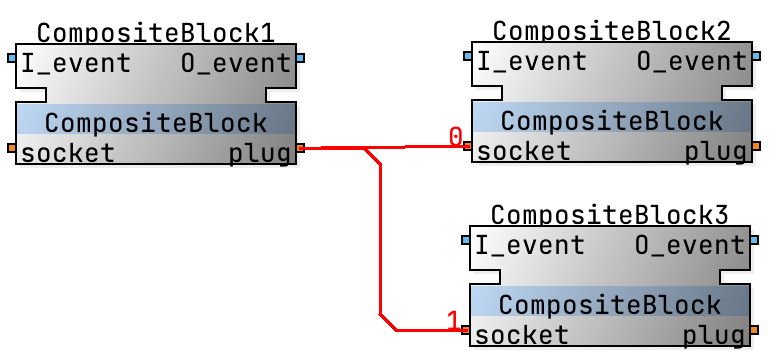
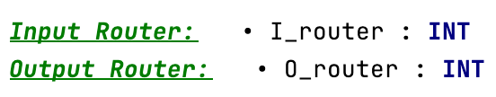
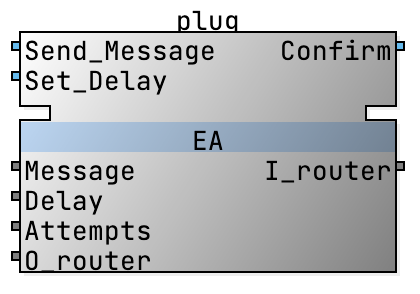
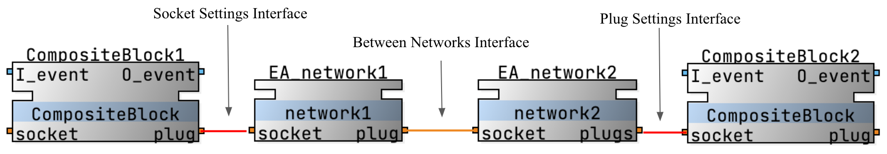

# Extended adapter

Adapter extension allows to implement dynamic connections between components and
add additional internal logic(internal fb networks) to the adapter declaration.

A new extended adapter type can be created like other elements,
and added to the socket and plug sections for other blocks, such as a common adapter.

You can convert a model that uses extended adapters to standard elements by selecting the
"Convert Extended Adapters to Standard Elements" option from the context menu.
As a result a copy of the current model will be created with suffix name "_extensions_revealed".
Networks that use extended adapters will be modified, and new models on the connection path will be added.
The new generated models will be stored in a directory with the prefix "generated".

Also, in the system module you can select the "Synchronize System Resources" action, which will reveal
all broken connections of the extended adapter type halfway in the resources and add publish/subscribe blocks.
If a broken connection has any connections in the resource it will not be modified.

## Dynamic adapter

Dynamic connection allows you to connect a plug with multiple sockets and choose at runtime which socket will receive message.
Sockets in dynamic connections are numbered.

To use dynamic adapter connections, data parameter "Input router" should be added with type INT in the adapter declaration.
Additionally, a parameter "Output router" should be defined to receive the number of socket that sent a message to plug.

These parameters appear in the plug and can be used in a similar way to other parameters.

## Adapter with internal networks

There are two fields that can be used to create an internal network in the adapter.
Left network executes on the plug side, right network on the socket side.
Both the left and right networks have editors with two specific blocks:
"Socket_Connection"(can be considered as a socket for an internal composite block, that will be added in every connection usage)
and "Plug_Connection".
These blocks are symmetrical at first, you can add additional parameters("Setting Interfaces") to the adapter declaration.
This allows you to pass certain parameters to the internal algorithm, but not to the other end of the connection.
The next image demonstrates which part of the connection each setting interface affects.

